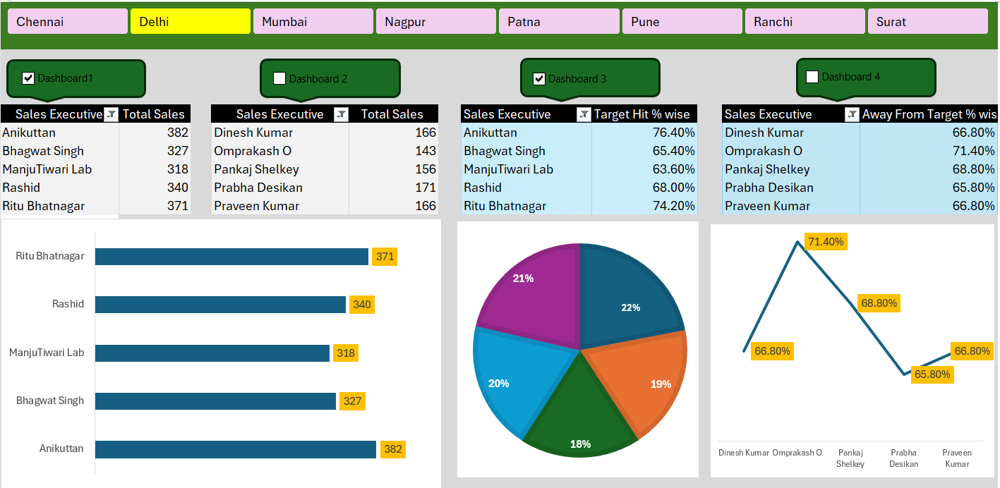

# 📊 Mobile Sales Dashboard using Microsoft Excel

## 📌 Project Overview

This project is an interactive Excel dashboard developed to analyze mobile sales data and identify trends in sales performance, customer behavior, city-wise sales, and payment methods.

The dashboard uses **Pivot Tables, Pivot Charts, Slicers, Conditional Formatting, and Excel formulas** to transform raw sales data into an interactive and easy-to-understand report.

---

## 🛠️ Tools & Techniques Used

- Microsoft Excel
- Pivot Tables
- Pivot Charts
- Slicers
- Conditional Formatting
- Excel Formulas
- Data Cleaning
- Data Analysis
- Data Visualization

---

## 📈 Dashboard Features

- Total Sales
- Total Quantity Sold
- Brand-wise Sales Analysis
- City-wise Sales Analysis
- Payment Method Analysis
- Customer Ratings Analysis
- Interactive Slicers
- Dynamic Charts
- KPI-based Sales Summary

---

## 📂 Files

- **Dashboard.xlsm** – Excel workbook containing the complete project, including the Dashboard and Raw Data sheets.
- **ExcelDashboard.png** – Dashboard preview image.
- **README.md** – Project documentation.

### Workbook Structure

**Dashboard**  
Contains the interactive sales dashboard, KPIs, charts, Pivot Tables/Pivot Charts, and slicers.

**Raw Data**  
Contains the underlying mobile sales dataset used for analysis and dashboard creation.

---

## 📸 Dashboard Preview

---

## 💡 Skills Demonstrated

- Data Cleaning
- Data Analysis
- Dashboard Development
- Data Visualization
- Business Reporting
- Excel-based Data Analysis
